<div align="center">


</div>

---

<div align="center">

## Connect With Me

[](https://www.linkedin.com/in/reethu-sri-420874287/)
[](mailto:guttareethusri27@gmail.com)
[](https://github.com/reethu-sri)

</div>

---

<div align="center">


</div>

## About Me


```python
class ReethusRi:
    def __init__(self):
        self.name = "Reethu Sri"
        self.role = "Cybersecurity Student"
        self.education = "Final Year"
        self.email = "guttareethusri27@gmail.com"
        self.location = "India"

    def get_current_focus(self):
        return [
            "Web Application Security",
            "Network Security",
            "Penetration Testing",
            "Vulnerability Assessment",
            "Security Research"
        ]

    def get_goals_2025(self):
        return [
            "Master Advanced Penetration Testing",
            "Contribute to Security Tools",
            "Obtain Security Certifications",
            "Build Defensive Security Projects"
        ]
```

<br clear="right"/>

---

## Security Arsenal

<div align="center">

### Languages & Technologies


### Security Tools & Frameworks


### Development & Platforms


</div>

---

## Areas of Interest

<div align="center">

<table>
<tr>
<td align="center" width="33%">

<h3>Web Security</h3>
<p>XSS, SQL Injection, CSRF<br/>OWASP Top 10</p>
</td>
<td align="center" width="33%">

<h3>Network Security</h3>
<p>Packet Analysis<br/>Intrusion Detection</p>
</td>
<td align="center" width="33%">

<h3>Penetration Testing</h3>
<p>Vulnerability Assessment<br/>Ethical Hacking</p>
</td>
</tr>
<tr>
<td align="center" width="33%">

<h3>Threat Intelligence</h3>
<p>Security Research<br/>Malware Analysis</p>
</td>
<td align="center" width="33%">

<h3>Secure Coding</h3>
<p>Code Review<br/>Security Best Practices</p>
</td>
<td align="center" width="33%">

<h3>Cloud Security</h3>
<p>Infrastructure Security<br/>Access Management</p>
</td>
</tr>
</table>

</div>

---

## GitHub Statistics

<div align="center">


</div>

---

## Current Learning Path

```mermaid
graph LR
    A[Network Fundamentals] --> B[Security Concepts]
    B --> C[Vulnerability Assessment]
    C --> D[Penetration Testing]
    D --> E[Advanced Exploitation]
    E --> F[Security Researcher]

    style A fill:#0D1117,stroke:#00D9FF,color:#fff
    style B fill:#0D1117,stroke:#00D9FF,color:#fff
    style C fill:#0D1117,stroke:#00D9FF,color:#fff
    style D fill:#0D1117,stroke:#00D9FF,color:#fff
    style E fill:#0D1117,stroke:#00D9FF,color:#fff
    style F fill:#00D9FF,stroke:#00D9FF,color:#000
```

<div align="center">



</div>

---

## Activity Graph

<div align="center">

[](https://github.com/reethu-sri)

</div>

---

## Profile Visitors

<div align="center">


</div>

---

<div align="center">

### Let's Collaborate on Security Projects!


**"Security is not a product, but a process." - Bruce Schneier**

</div>

---


